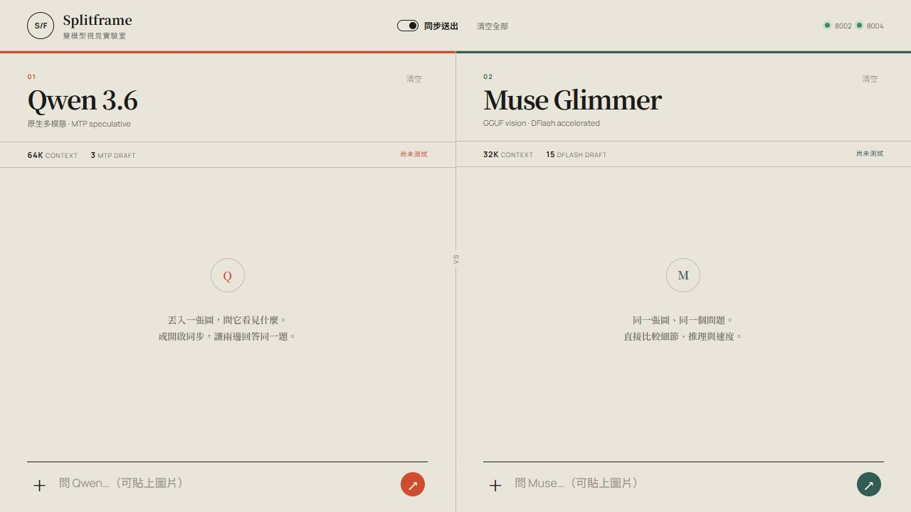
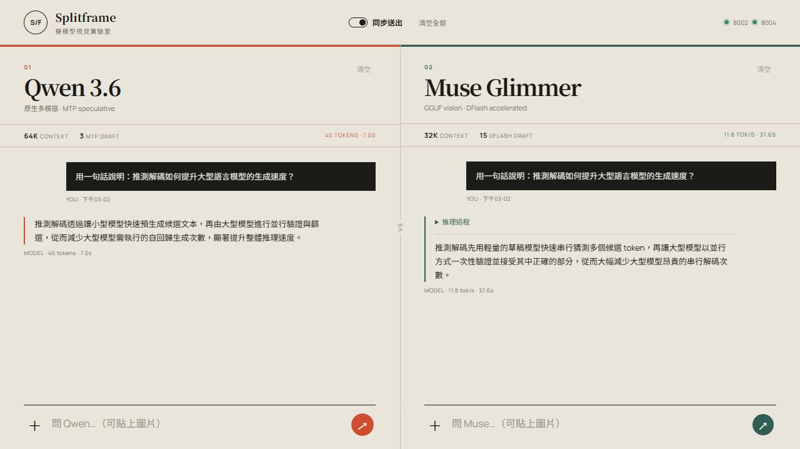

# Qwen 3.6 + Muse Glimmer on NVIDIA DGX Spark

A reproducible coexistence experiment and a purpose-built multimodal A/B console for two local models on one NVIDIA GB10 system.



### Live synchronized comparison

The same Chinese prompt was submitted to both models through the deployed console:



## What is included

- Qwen 3.6 NVFP4 deployment with native vision and MTP speculative decoding.
- Muse Glimmer 30B GGUF deployment with vision mmproj and DFlash.
- GB10-specific llama.cpp CUDA build (`sm_121a`).
- Splitframe: a responsive side-by-side chat and image comparison console.
- Exact experiment configuration, failures, fixes, resource snapshot and measured results.

Read the full [experiment record](docs/EXPERIMENT.md).

## Architecture

```text
Browser :8005
    │
    ├── /api/qwen/chat ──> Qwen 3.6 / vLLM :8002
    └── /api/muse/chat ──> Muse Glimmer / llama.cpp :8004
```

The browser never talks directly to the model servers. The small Node proxy avoids CORS problems and keeps endpoint routing in one place.

## Deploy the models

### Qwen 3.6

```bash
chmod +x deploy/qwen/run-coexist.sh
./deploy/qwen/run-coexist.sh
curl -f http://127.0.0.1:8002/health
```

The original 262K/4-sequence configuration can be restored with `deploy/qwen/restore-original.sh`.

### Muse Glimmer

Download the three official GGUF files listed in [EXPERIMENT.md](docs/EXPERIMENT.md) into one model directory, then:

```bash
docker build -t muse-glimmer-llamacpp:ngc2603-b10353 deploy/muse
chmod +x deploy/muse/run.sh
MODEL_DIR=/path/to/Muse-Glimmer-30B-GGUF ./deploy/muse/run.sh
curl -f http://127.0.0.1:8004/health
```

## Deploy Splitframe

```bash
docker build -t splitframe:latest .
docker rm -f splitframe 2>/dev/null || true
docker run -d \
  --name splitframe \
  --restart unless-stopped \
  --network host \
  splitframe:latest
```

Open `http://<spark-ip>:8005`.

Features include independent histories, individual or synchronized prompts, drag/drop/paste image input, multiple-image previews, reasoning disclosure, latency/token metrics, health indicators, and a mobile layout.

## Reproduce the comparison

1. Confirm `/api/health` reports both models as `true`.
2. Enable **同步送出**.
3. Add the same image and question to either side.
4. Submit once; Splitframe sends the same content to both models concurrently.
5. Compare response details and the per-lane timing line.

## Important notes

- Model weights are not included.
- The published numbers are a deployment validation, not a broad benchmark suite.
- No authentication is enabled by default. Use only on a trusted LAN or add an authenticated reverse proxy.
- NVIDIA, Qwen and Meta model licenses remain applicable to their respective artifacts.

## License

Splitframe code and deployment scripts are released under the [MIT License](LICENSE).
